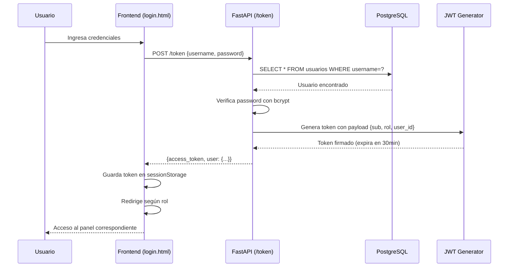

# 🏥 Sistema de Historia Clínica Electrónica Distribuida

> Sistema integral de gestión de historias clínicas electrónicas con arquitectura distribuida, autenticación por roles y exportación a PDF

[](https://fastapi.tiangolo.com/)
[](https://www.citusdata.com/)
[](https://minikube.sigs.k8s.io/)
[](https://www.python.org/)
[](https://flask.palletsprojects.com/)

---

## 📋 Tabla de Contenidos

- [Descripción del Proyecto](#-descripción-del-proyecto)
- [Características Principales](#-características-principales)
- [Arquitectura del Sistema](#-arquitectura-del-sistema)
- [Requisitos Previos](#-requisitos-previos)
- [Instalación y Despliegue](#-instalación-y-despliegue)
- [Configuración de Acceso](#-configuración-de-acceso)
- [Uso del Sistema](#-uso-del-sistema)
- [Autenticación y Roles](#-autenticación-y-roles)
- [API Endpoints](#-api-endpoints)
- [Exportación a PDF](#-exportación-a-pdf)
- [Estructura del Proyecto](#-estructura-del-proyecto)
- [Documentación Técnica](#-documentación-técnica)
- [Troubleshooting](#-troubleshooting)

---

## 🎯 Descripción del Proyecto

**Sistema de Historia Clínica Electrónica Distribuida** es una solución completa para la gestión de historias clínicas médicas, diseñada con arquitectura de microservicios y base de datos distribuida. El sistema permite el acceso seguro desde cualquier dispositivo (escritorio, tablet, smartphone) mediante autenticación OAuth2 + JWT, con control de acceso basado en roles y exportación de historias clínicas en formato PDF.

### 🎓 Contexto Académico

Este proyecto fue desarrollado como parte de la asignatura **"Sistemas distribuidos"**, implementando las mejores prácticas en:

- Arquitectura distribuida con fragmentación de datos
- Seguridad mediante OAuth2 + JWT
- Orquestación con Kubernetes
- Patrones de diseño de microservicios
- Control de acceso basado en roles (RBAC)

---

## ✨ Características Principales

### 🎯 Funcionalidades Core

- ✅ **Base de Datos Distribuida**: PostgreSQL + Citus con fragmentación por `numero_documento` (32 shards)
- ✅ **API REST Completa**: FastAPI con validación Pydantic y documentación automática
- ✅ **Sistema de Roles**: 5 roles diferenciados con permisos granulares
- ✅ **Autenticación Robusta**: OAuth2 + JWT con tokens de 30 minutos + bcrypt
- ✅ **CRUD Completo**: Operaciones sobre pacientes con control de acceso
- ✅ **Exportación PDF**: Generación de historias clínicas con WeasyPrint
- ✅ **Acceso Multi-dispositivo**: Desde red local (smartphones, tablets, PCs)
- ✅ **57 Campos Clínicos**: Modelo completo según estándares colombianos
- ✅ **Orquestación**: Kubernetes (Minikube) con alta disponibilidad
- ✅ **Interfaces Gráficas**: 7 vistas HTML diferenciadas por rol

### 🛡️ Seguridad

- 🔐 Autenticación con base de datos usando bcrypt
- 🔑 Tokens JWT con expiración configurable
- 👥 Control de acceso basado en roles (RBAC)
- 📝 Validación de permisos por endpoint
- 🔒 Secrets de Kubernetes para credenciales sensibles
- 🚫 Protección contra acceso no autorizado

### 🌐 Accesibilidad

- 📱 Acceso desde dispositivos móviles en red local
- 💻 Interfaz web responsiva con Bootstrap 5
- 🔗 NodePort configurado para acceso externo
- 📡 Port forwarding automático para red local
- ⚡ Configuración automatizada con scripts

---

## 🏗️ Arquitectura del Sistema

### Diagrama de Componentes

```
┌─────────────────────────────────────────────────────────────┐
│                   CAPA DE PRESENTACIÓN                       │
│  ┌──────────┐  ┌──────────┐  ┌──────────────────────────┐  │
│  │Swagger UI│  │  ReDoc   │  │  Interfaces Web (Flask)  │  │
│  └────┬─────┘  └────┬─────┘  └────────────┬─────────────┘  │
│       └─────────────┴──────────────────────┘                │
│                       │ HTTP/REST                            │
└───────────────────────┼─────────────────────────────────────┘
                        │
┌───────────────────────▼─────────────────────────────────────┐
│                  CAPA DE APLICACIÓN                          │
│  ┌─────────────────────────────────────────────────────┐    │
│  │         FastAPI Middleware (Python 3.10)            │    │
│  │  ┌──────────┐  ┌──────────┐  ┌───────────────┐     │    │
│  │  │   JWT    │  │   CRUD   │  │  WeasyPrint   │     │    │
│  │  │  OAuth2  │  │  + RBAC  │  │  PDF Export   │     │    │
│  │  └──────────┘  └──────────┘  └───────────────┘     │    │
│  │                                                      │    │
│  │  Endpoints Principales:                             │    │
│  │  • POST /token → Autenticación                      │    │
│  │  • GET /me → Usuario actual                         │    │
│  │  • GET /pacientes → Listar (RBAC)                   │    │
│  │  • POST /pacientes → Crear                          │    │
│  │  • GET /pacientes/{doc}/pdf → Exportar              │    │
│  └──────────────────────────────────────────────────────┘   │
│                       │ psycopg2                             │
└───────────────────────┼─────────────────────────────────────┘
                        │
┌───────────────────────▼─────────────────────────────────────┐
│                    CAPA DE DATOS                             │
│  ┌─────────────────────────────────────────────────────┐    │
│  │       Citus Coordinator (PostgreSQL 12.1)           │    │
│  │                                                      │    │
│  │  Tablas:                                            │    │
│  │  • usuarios (con bcrypt)                            │    │
│  │  • pacientes (57 campos, distribuida, 32 shards)    │    │
│  │                                                      │    │
│  │  Extensiones: citus, pgcrypto                       │    │
│  └───────┬─────────────────────────────┬────────────────┘   │
│          │                             │                     │
│    ┌─────▼──────┐              ┌──────▼─────┐              │
│    │  Worker 1  │              │  Worker 2  │              │
│    └────────────┘              └────────────┘              │
└─────────────────────────────────────────────────────────────┘
                        │
┌───────────────────────▼─────────────────────────────────────┐
│              CAPA DE INFRAESTRUCTURA                         │
│  ┌─────────────────────────────────────────────────────┐    │
│  │    Kubernetes (Minikube) - Namespace: citus        │    │
│  │                                                      │    │
│  │  Services:                 Deployments:             │    │
│  │  • citus-coordinator       • coordinator (1 pod)    │    │
│  │  • citus-worker            • workers (2 pods)       │    │
│  │  • middleware-service      • middleware (1 pod)     │    │
│  │    (NodePort: 30800)                                │    │
│  │                                                      │    │
│  │  Secrets: app-secrets (credenciales cifradas)      │    │
│  └─────────────────────────────────────────────────────┘    │
└─────────────────────────────────────────────────────────────┘
```

### 🔐 Flujo de Autenticación OAuth2 + JWT

```
┌─────────┐                                    ┌─────────┐
│ Cliente │                                    │   API   │
└────┬────┘                                    └────┬────┘
     │                                              │
     │  POST /token                                 │
     │  {username, password}                        │
     ├─────────────────────────────────────────────>│
     │                                              │
     │                                   ┌──────────▼──────────┐
     │                                   │ 1. Consultar BD     │
     │                                   │ 2. Verificar bcrypt │
     │                                   │ 3. Generar JWT      │
     │                                   └──────────┬──────────┘
     │                                              │
     │  200 OK + {access_token, user}               │
     │<─────────────────────────────────────────────┤
     │                                              │
     │  GET /pacientes                              │
     │  Authorization: Bearer <token>               │
     ├─────────────────────────────────────────────>│
     │                                              │
     │                                   ┌──────────▼──────────┐
     │                                   │ 1. Validar JWT      │
     │                                   │ 2. Verificar rol    │
     │                                   │ 3. Ejecutar query   │
     │                                   └──────────┬──────────┘
     │                                              │
     │  200 OK + [{pacientes}]                      │
     │<─────────────────────────────────────────────┤
```

### 🗄️ Fragmentación de Datos en Citus

**Estrategia**: Fragmentación por `numero_documento` (hash distribution)

**Justificación**:
- ✅ Alta cardinalidad (cada documento es único)
- ✅ Distribución uniforme entre workers
- ✅ Consultas por documento son muy frecuentes
- ✅ Evita hot spots y cuellos de botella

**Configuración**:
```sql
SELECT create_distributed_table('public.pacientes', 'numero_documento');
-- Resultado: 32 shards distribuidos entre coordinator y 2 workers
```

---

## 📦 Requisitos Previos

### Software Necesario

| Software | Versión Mínima | Verificación |
|----------|----------------|--------------|
| **Minikube** | v1.30+ | `minikube version` |
| **kubectl** | v1.28+ | `kubectl version --client` |
| **Docker** | v20.10+ | `docker --version` |
| **Python** | 3.10+ | `python3 --version` |
| **curl** | Cualquiera | `curl --version` |

### Recursos de Hardware

| Recurso | Mínimo | Recomendado |
|---------|--------|-------------|
| **CPU** | 4 cores | 8 cores |
| **RAM** | 4 GB | 8 GB |
| **Disco** | 10 GB libre | 20 GB libre |

### Instalación Rápida (Arch Linux)

```bash
# Minikube
sudo pacman -S minikube

# kubectl
sudo pacman -S kubectl

# Docker
sudo pacman -S docker
sudo systemctl enable --now docker
sudo usermod -aG docker $USER

# Python 3.10
sudo pacman -S python python-pip
```

---

## 🚀 Instalación y Despliegue

### Opción 1: Despliegue Automatizado Completo (Recomendado)

El script `inicializador.sh` ejecuta **todos los pasos** de forma secuencial:

```bash
# Clonar repositorio
git clone <URL_DEL_REPOSITORIO>
cd Historia-Clinica-Distribuida

# Dar permisos de ejecución
chmod +x inicializador.sh

# Ejecutar instalación completa
./inicializador.sh
```

**⏱️ Tiempo estimado**: 10-15 minutos

**¿Qué hace este script?**

1. ✅ Verifica requisitos (Minikube, kubectl, Docker, Python)
2. ✅ Inicia Minikube con recursos adecuados
3. ✅ Crea namespace `citus`
4. ✅ Despliega Citus (1 coordinator + 2 workers)
5. ✅ Configura base de datos `historiaclinica`
6. ✅ Crea tablas `usuarios` y `pacientes` (57 campos)
7. ✅ Inserta usuarios y pacientes de prueba
8. ✅ Construye imagen Docker del middleware
9. ✅ Crea Kubernetes secrets
10. ✅ Despliega middleware con NodePort
11. ✅ Configura exposición a red local
12. ✅ **Lanza servidor frontend automáticamente**

**Salida esperada**:

```
================================================================
  ✓ Backend listo y expuesto en http://192.168.1.X:8000
  🚀 El frontend se lanzará a continuación en http://localhost:5000
================================================================

🏥 FRONTEND - SISTEMA DE HISTORIA CLÍNICA
================================================================

URLs disponibles:
   • http://localhost:5000/              (Login)
   • http://localhost:5000/medico.html   (Panel Médico)
   • http://localhost:5000/paciente.html (Panel Paciente)

Backend (FastAPI):
   • http://192.168.1.X:8000/docs

✅ Servidor listo.
```

### Opción 2: Despliegue Manual por Pasos

Si prefieres control total sobre cada fase:

#### Paso 1: Configurar Backend

```bash
cd backend/project
chmod +x setup.sh
./setup.sh 2>&1 | tee setup_log.txt
```

#### Paso 2: Habilitar NodePort

```bash
chmod +x enable_nodeport.sh
./enable_nodeport.sh 2>&1 | tee nodeport_setup.log
```

#### Paso 3: Exponer a Red Local (Host)

```bash
chmod +x expose_to_network.sh
./expose_to_network.sh
```

#### Paso 4: Exponer a Red Real (Dispositivos Móviles)

```bash
chmod +x expose_to_real_network.sh
./expose_to_real_network.sh
```

#### Paso 5: Lanzar Frontend

```bash
cd ../../frontend
python3 -m venv .venv
source .venv/bin/activate
pip install -r requirements.txt
python3 prueba.py
```

---

## 🌐 Configuración de Acceso

### Acceso Local (Port-Forward)

```bash
kubectl port-forward -n citus service/middleware-citus-service 8000:8000 &
```

**URLs**:
- Backend API: `http://localhost:8000`
- Swagger UI: `http://localhost:8000/docs`
- Frontend: `http://localhost:5000`

### Acceso desde Red Local (NodePort)

Después de ejecutar `enable_nodeport.sh`:

```bash
# Obtener IP de Minikube
minikube ip
# Ejemplo: 192.168.49.2

# Acceder desde cualquier PC en la red
curl http://192.168.49.2:30800/health
```

**URLs**:
- Backend: `http://192.168.49.2:30800`
- Swagger: `http://192.168.49.2:30800/docs`

### Acceso desde Dispositivos Móviles

Después de ejecutar `expose_to_real_network.sh`:

```bash
# El script detecta automáticamente tu IP local
# Ejemplo salida:
# IP de red local detectada: 192.168.1.100
```

**Desde smartphone/tablet**:

1. Conecta el dispositivo a la **misma red WiFi**
2. Abre el navegador
3. Navega a `http://192.168.1.100:8000/docs`

**URLs disponibles**:
- Backend: `http://192.168.1.100:8000`
- Frontend: `http://192.168.1.100:5000`

---

## 💻 Uso del Sistema

### Login

**URL**: `http://localhost:5000/login.html`

**Usuarios de Prueba**:

| Username | Contraseña | Rol | Descripción |
|----------|-----------|-----|-------------|
| `admin` | `admin` | Admin | Administrador del sistema |
| `dr_rodriguez` | `password123` | Médico | Dr. Carlos Rodríguez |
| `dra_martinez` | `password123` | Médico | Dra. Ana Martínez |
| `admisionista1` | `password123` | Admisionista | María González |
| `resultados1` | `password123` | Resultados | Pedro López |
| `paciente_juan` | `password123` | Paciente | Juan Pérez (doc: 12345) |
| `paciente_maria` | `password123` | Paciente | María Gómez (doc: 67890) |

### Flujo de Trabajo Típico

#### Como Médico:

1. Login → Redirige a `medico.html`
2. **Buscar paciente**: Por documento o nombre
3. **Ver historia clínica**: Click en "Ver"
4. **Editar historia**: Click en "Editar" → Actualizar campos
5. **Exportar PDF**: Click en "Descargar PDF"

#### Como Admisionista:

1. Login → Redirige a `admisionista.html`
2. **Registrar nuevo paciente**: Click en "Registrar Nuevo Paciente"
3. Completar formulario (campos obligatorios: documento, nombre, fecha nacimiento, sexo)
4. **Guardar**: Sistema crea historia clínica

#### Como Paciente:

1. Login → Redirige a `paciente.html`
2. **Ver mi historia**: Solo lectura de datos propios
3. **Descargar PDF**: Click en "Descargar Historia en PDF"

---

## 🔐 Autenticación y Roles

### Sistema de Roles

El sistema implementa **RBAC (Role-Based Access Control)** con 5 roles:

| Rol | Permisos | Descripción |
|-----|----------|-------------|
| **👑 Admin** | Acceso total | Gestión de usuarios, todas las historias, estadísticas |
| **👨‍⚕️ Médico** | Lectura/Escritura | Acceso completo a historias, crear y modificar |
| **📋 Admisionista** | Crear/Actualizar | Registro de nuevos pacientes, datos básicos |
| **🧪 Resultados** | Agregar resultados | Ingresar resultados de exámenes |
| **🙍 Paciente** | Solo lectura propia | Ver únicamente su propia historia |

### Matriz de Permisos

| Acción | Admin | Médico | Admisionista | Resultados | Paciente |
|--------|-------|--------|--------------|------------|----------|
| Ver cualquier historia | ✅ | ✅ | ✅ | ✅ | ❌ |
| Ver propia historia | ✅ | ✅ | ✅ | ✅ | ✅ |
| Crear paciente | ✅ | ✅ | ✅ | ❌ | ❌ |
| Actualizar paciente | ✅ | ✅ | ❌ | ❌ | ❌ |
| Eliminar paciente | ✅ | ❌ | ❌ | ❌ | ❌ |
| Gestionar usuarios | ✅ | ❌ | ❌ | ❌ | ❌ |
| Ver estadísticas | ✅ | ❌ | ❌ | ❌ | ❌ |
| Exportar PDF | ✅ | ✅ | ✅ | ✅ | ✅ (propio) |

### Obtener Token JWT

```bash
curl -X POST http://localhost:8000/token \
  -H "Content-Type: application/json" \
  -d '{
    "username": "admin",
    "password": "admin"
  }'
```

**Respuesta**:

```json
{
  "access_token": "eyJhbGciOiJIUzI1NiIsInR5cCI6IkpXVCJ9...",
  "token_type": "bearer",
  "expires_in": 1800,
  "user": {
    "id": 1,
    "username": "admin",
    "rol": "admin",
    "nombres": "Administrador",
    "apellidos": "Sistema"
  }
}
```

### Usar Token en Requests

```bash
TOKEN="eyJhbGciOiJIUzI1NiIsInR5cCI6IkpXVCJ9..."

curl http://localhost:8000/pacientes \
  -H "Authorization: Bearer $TOKEN"
```

---

## 📡 API Endpoints

### Documentación Interactiva

- **Swagger UI**: `http://localhost:8000/docs`
- **ReDoc**: `http://localhost:8000/redoc`
- **OpenAPI JSON**: `http://localhost:8000/openapi.json`

### Endpoints Públicos

| Método | Endpoint | Descripción |
|--------|----------|-------------|
| `GET` | `/` | Información general de la API |
| `GET` | `/health` | Estado del sistema y BD |
| `POST` | `/token` | Autenticación (retorna JWT) |

### Endpoints Protegidos - Pacientes

| Método | Endpoint | Roles | Descripción |
|--------|----------|-------|-------------|
| `GET` | `/pacientes` | Staff | Listar pacientes (resumido) |
| `GET` | `/pacientes/{doc}` | Staff, Paciente (propio) | Historia clínica completa |
| `POST` | `/pacientes` | Admisionista, Médico, Admin | Crear paciente |
| `PUT` | `/pacientes/{doc}` | Médico, Admin | Actualizar paciente |
| `DELETE` | `/pacientes/{doc}` | Admin | Eliminar (lógico) |
| `GET` | `/pacientes/buscar/query` | Staff | Buscar por nombre/documento |
| `GET` | `/pacientes/{doc}/pdf` | Staff, Paciente (propio) | Exportar PDF |

### Endpoints Protegidos - Usuarios

| Método | Endpoint | Roles | Descripción |
|--------|----------|-------|-------------|
| `GET` | `/me` | Todos | Usuario actual |
| `GET` | `/usuarios` | Admin | Listar usuarios |
| `POST` | `/usuarios` | Admin | Crear usuario |

### Endpoints Protegidos - Estadísticas

| Método | Endpoint | Roles | Descripción |
|--------|----------|-------|-------------|
| `GET` | `/estadisticas` | Admin | Estadísticas generales |

### Ejemplos de Uso

#### Crear Paciente

```bash
TOKEN="<tu_token>"

curl -X POST http://localhost:8000/pacientes \
  -H "Authorization: Bearer $TOKEN" \
  -H "Content-Type: application/json" \
  -d '{
    "tipo_documento": "CC",
    "numero_documento": "98765432",
    "primer_apellido": "García",
    "primer_nombre": "Laura",
    "fecha_nacimiento": "1992-08-20",
    "sexo": "F",
    "celular": "3201234567"
  }'
```

#### Buscar Paciente

```bash
curl "http://localhost:8000/pacientes/buscar/query?nombre=Laura" \
  -H "Authorization: Bearer $TOKEN"
```

#### Actualizar Paciente

```bash
curl -X PUT http://localhost:8000/pacientes/98765432 \
  -H "Authorization: Bearer $TOKEN" \
  -H "Content-Type: application/json" \
  -d '{
    "telefono": "3109876543",
    "motivo_consulta": "Control mensual"
  }'
```

---

## 📄 Exportación a PDF

### Generar PDF desde API

```bash
curl http://localhost:8000/pacientes/12345/pdf \
  -H "Authorization: Bearer $TOKEN" \
  --output historia_12345.pdf
```

### Características del PDF

- ✅ Encabezado profesional con logo
- ✅ 57 campos organizados por secciones
- ✅ Datos completos del paciente
- ✅ Signos vitales con formato visual
- ✅ Diagnósticos y tratamientos
- ✅ Pie de página con info legal
- ✅ Formato Letter (8.5" × 11")
- ✅ Protegido por autenticación

### Secciones del PDF

1. **Identificación del Paciente** (23 campos)
2. **Datos de Atención Médica** (17 campos)
3. **Antecedentes** (5 campos)
4. **Signos Vitales** (9 campos)
5. **Examen Físico y Diagnóstico** (9 campos)
6. **Conducta y Tratamiento** (7 campos)
7. **Procedimientos y Resultados** (7 campos)
8. **Evolución y Egreso** (3 campos)
9. **Datos del Profesional** (8 campos)

### Desde Interfaz Web

1. Login → Panel correspondiente
2. Buscar paciente
3. Click en **"Descargar PDF"** o **"📄 PDF"**
4. El navegador descarga automáticamente

---

## 📁 Estructura del Proyecto

```
Historia-Clinica-Distribuida/
│
├── backend/
│   └── project/
│       ├── app/
│       │   ├── __init__.py
│       │   ├── main.py              # FastAPI app principal
│       │   ├── auth.py              # OAuth2 + JWT + RBAC
│       │   ├── database.py          # Conexión Citus
│       │   ├── models.py            # Modelos Pydantic (57 campos)
│       │   └── pdf_generator.py     # WeasyPrint PDFs
│       │
│       ├── infra/
│       │   ├── citus-deployment.yaml           # Citus coordinator + workers
│       │   ├── app-deployment.yaml             # Middleware (ClusterIP)
│       │   ├── app-deployment-nodeport.yaml    # Middleware (NodePort)
│       │   └── initdb/                         # Scripts SQL inicialización
│       │       ├── 01_create_extension.sql
│       │       ├── 06_create_usuarios.sql
│       │       ├── 07_create_pacientes_completo.sql
│       │       └── 08_insert_data_complete.sql
│       │
│       ├── Dockerfile               # Imagen middleware
│       ├── requirements.txt         # Dependencias Python (backend)
│       ├── setup.sh                 # Instalación completa backend ⚡
│       ├── enable_nodeport.sh       # Configurar NodePort
│       ├── expose_to_network.sh     # Exponer a host
│       └── expose_to_real_network.sh # Exponer a red real
│
├── frontend/
│   ├── templates/                   # Vistas HTML
│   │   ├── login.html               # Página de login
│   │   ├── medico.html              # Panel médico
│   │   ├── paciente.html            # Panel paciente
│   │   ├── admisionista.html        # Panel admisionista
│   │   ├── resultados.html          # Panel resultados
│   │   ├── panel_admin.html         # Panel admin
│   │   ├── gestionar_usuarios.html  # Gestión usuarios
│   │   ├── reportes.html            # Reportes y estadísticas
│   │   ├── registrar_paciente.html  # Formulario 57 campos
│   │   ├── ver_historia_clinica.html # Vista completa HC
│   │   ├── editar_historia_clinica.html # Edición HC
│   │   └── historia_pdf.html        # Visor PDF
│   │
│   ├── static/
│   │   ├── js/
│   │   │   └── config.js            # Configuración API + utilidades
│   │   └── css/
│   │       └── style.css
│   │
│   ├── prueba.py                    # Servidor Flask
│   └── requirements.txt             # Dependencias Python (frontend)
│
├── inicializador.sh                 # 🚀 Script unificado TODO-EN-UNO
├── README.md                        # Este archivo
└── .gitignore
```

### 📚 Documentación Técnica 

#### Modelo de Datos - Tabla `pacientes` (57 Campos)

##### 1. Identificación del Paciente (23 campos)

| Campo | Tipo | Obligatorio | Descripción |
|-------|------|-------------|-------------|
| `tipo_documento` | VARCHAR(20) | ✅ | CC, TI, CE, PA, RC |
| `numero_documento` | VARCHAR(20) | ✅ | **Clave de distribución** (único) |
| `primer_apellido` | VARCHAR(100) | ✅ | Apellido paterno |
| `segundo_apellido` | VARCHAR(100) | ❌ | Apellido materno |
| `primer_nombre` | VARCHAR(100) | ✅ | Nombre principal |
| `segundo_nombre` | VARCHAR(100) | ❌ | Segundo nombre |
| `fecha_nacimiento` | DATE | ✅ | Fecha de nacimiento |
| `sexo` | VARCHAR(10) | ✅ | M, F, Otro |
| `genero` | VARCHAR(50) | ❌ | Identidad de género |
| `grupo_sanguineo` | VARCHAR(5) | ❌ | A+, A-, B+, B-, AB+, AB-, O+, O- |
| `factor_rh` | VARCHAR(10) | ❌ | Positivo, Negativo |
| `estado_civil` | VARCHAR(20) | ❌ | Soltero, Casado, Unión Libre, Divorciado, Viudo |
| `direccion_residencia` | TEXT | ❌ | Dirección completa |
| `municipio` | VARCHAR(100) | ❌ | Ciudad o municipio |
| `departamento` | VARCHAR(100) | ❌ | Departamento/Estado |
| `telefono` | VARCHAR(20) | ❌ | Teléfono fijo |
| `celular` | VARCHAR(20) | ❌ | Teléfono móvil |
| `correo_electronico` | VARCHAR(100) | ❌ | Email del paciente |
| `ocupacion` | VARCHAR(100) | ❌ | Profesión u oficio |
| `entidad` | VARCHAR(100) | ❌ | EPS o ARL |
| `regimen_afiliacion` | VARCHAR(50) | ❌ | Contributivo, Subsidiado, Especial, No afiliado |
| `tipo_usuario` | VARCHAR(50) | ❌ | Cotizante, Beneficiario, etc. |

##### 2. Datos Administrativos de Atención (17 campos)

| Campo | Tipo | Descripción |
|-------|------|-------------|
| `fecha_atencion` | TIMESTAMP | Fecha y hora de la consulta (default: NOW()) |
| `tipo_atencion` | VARCHAR(50) | Urgencias, Consulta Externa, Hospitalización, Cirugía, Procedimiento |
| `motivo_consulta` | TEXT | Razón de la visita médica |
| `enfermedad_actual` | TEXT | Descripción del problema actual |
| `antecedentes_personales` | TEXT | Historial médico previo del paciente |
| `antecedentes_familiares` | TEXT | Historial médico familiar relevante |
| `alergias_conocidas` | TEXT | **⚠️ Importante para prescripción** |
| `habitos` | TEXT | Alcohol, tabaco, drogas, alimentación, ejercicio |
| `medicamentos_actuales` | TEXT | Medicación que toma actualmente |

##### 3. Signos Vitales (9 campos)

| Campo | Tipo | Rango | Unidad |
|-------|------|-------|--------|
| `tension_arterial` | VARCHAR(20) | - | mmHg (ej: "120/80") |
| `frecuencia_cardiaca` | INTEGER | 0-300 | lpm (latidos por minuto) |
| `frecuencia_respiratoria` | INTEGER | 0-100 | rpm (respiraciones por minuto) |
| `temperatura` | DECIMAL(4,2) | 30.0-45.0 | °C (grados Celsius) |
| `saturacion_oxigeno` | INTEGER | 0-100 | % (porcentaje) |
| `peso` | DECIMAL(5,2) | 0-500 | kg (kilogramos) |
| `talla` | DECIMAL(5,2) | 0-300 | cm (centímetros) |

**Campos calculados** (generados por la API):
- `edad`: Calculada desde `fecha_nacimiento`
- `imc`: Calculado como `peso / (talla/100)²`

##### 4. Examen Físico y Diagnóstico (9 campos)

| Campo | Tipo | Descripción |
|-------|------|-------------|
| `examen_fisico_general` | TEXT | Descripción del examen físico general |
| `examen_fisico_sistemas` | TEXT | Examen por sistemas (cardiovascular, respiratorio, etc.) |
| `impresion_diagnostica` | TEXT | Diagnóstico presuntivo |
| `codigos_cie10` | TEXT | Códigos de clasificación internacional de enfermedades |
| `conducta_plan` | TEXT | Plan de tratamiento y seguimiento |
| `recomendaciones` | TEXT | Indicaciones para el paciente |
| `medicos_interconsultados` | TEXT | Especialistas consultados |
| `procedimientos_realizados` | TEXT | Procedimientos médicos aplicados |
| `resultados_examenes` | TEXT | Resultados de laboratorio, imágenes, etc. |

##### 5. Cierre y Seguimiento (7 campos)

| Campo | Tipo | Descripción |
|-------|------|-------------|
| `diagnostico_definitivo` | TEXT | Diagnóstico confirmado |
| `evolucion_medica` | TEXT | Evolución del paciente durante atención |
| `tratamiento_instaurado` | TEXT | Tratamiento aplicado |
| `formulacion_medica` | TEXT | Receta médica detallada (medicamentos, dosis, frecuencia) |
| `educacion_paciente` | TEXT | Consejería e indicaciones al paciente |
| `referencia_contrarreferencia` | TEXT | Remisiones a otros niveles de atención |
| `estado_egreso` | VARCHAR(50) | Mejorado, Igual, Empeorado, Fallecido, Remitido |

##### 6. Datos del Profesional (8 campos)

| Campo | Tipo | Descripción |
|-------|------|-------------|
| `nombre_profesional` | VARCHAR(200) | Nombre del médico o profesional |
| `tipo_profesional` | VARCHAR(50) | Médico, Enfermero, Odontólogo, etc. |
| `registro_medico` | VARCHAR(50) | Número de tarjeta profesional |
| `cargo_servicio` | VARCHAR(100) | Cargo o área de trabajo |
| `firma_profesional` | TEXT | Campo para firma digital |
| `firma_paciente` | TEXT | Campo para firma del paciente |
| `fecha_cierre` | TIMESTAMP | Fecha y hora de cierre de atención |
| `responsable_registro` | VARCHAR(200) | Persona que registró los datos |

##### 7. Metadatos del Sistema (3 campos)

| Campo | Tipo | Descripción |
|-------|------|-------------|
| `fecha_registro` | TIMESTAMP | Fecha de creación del registro (default: NOW()) |
| `ultima_actualizacion` | TIMESTAMP | Fecha de última modificación (default: NOW()) |
| `activo` | BOOLEAN | Estado del registro (default: TRUE) |

---

#### Modelo de Datos - Tabla `usuarios`

| Campo | Tipo | Descripción |
|-------|------|-------------|
| `id` | SERIAL | Identificador único |
| `username` | VARCHAR(50) | Nombre de usuario (único) |
| `password_hash` | VARCHAR(255) | Contraseña hasheada con bcrypt |
| `rol` | VARCHAR(20) | paciente, medico, admisionista, resultados, admin |
| `nombres` | VARCHAR(200) | Nombres del usuario |
| `apellidos` | VARCHAR(200) | Apellidos del usuario |
| `documento_vinculado` | VARCHAR(20) | Referencia al `numero_documento` de pacientes (si aplica) |
| `activo` | BOOLEAN | Estado de la cuenta (default: TRUE) |
| `fecha_creacion` | TIMESTAMP | Fecha de creación de la cuenta |
| `ultimo_acceso` | TIMESTAMP | Última vez que inició sesión |

**Índices**:
```sql
CREATE INDEX idx_usuarios_username ON public.usuarios(username);
CREATE INDEX idx_usuarios_rol ON public.usuarios(rol);
CREATE INDEX idx_usuarios_documento ON public.usuarios(documento_vinculado);
```

---

### 🔐 Sistema de Autenticación

#### Flujo de Login Completo



#### Estructura del Token JWT

```json
{
  "header": {
    "alg": "HS256",
    "typ": "JWT"
  },
  "payload": {
    "sub": "dr_rodriguez",
    "rol": "medico",
    "user_id": 2,
    "iat": 1732065000,
    "exp": 1732066800
  },
  "signature": "..."
}
```

#### Validación de Permisos (Middleware)

```python
# Ejemplo de uso en endpoints
@app.get("/pacientes")
async def listar_pacientes(
    current_user: Usuario = Depends(require_staff())
):
    # Solo médicos, admisionistas, resultados y admin
    pass

@app.put("/pacientes/{doc}")
async def actualizar_paciente(
    doc: str,
    current_user: Usuario = Depends(require_medico())
):
    # Solo médicos y admin
    pass
```

---

### 📊 Fragmentación y Distribución con Citus

#### Estrategia de Sharding

```sql
-- Distribuir tabla por numero_documento (hash distribution)
SELECT create_distributed_table('public.pacientes', 'numero_documento');
```

**Resultado**:
- **32 shards** distribuidos entre coordinator y 2 workers
- Distribución automática por hash del `numero_documento`
- Consultas por documento se enrutan al shard correcto

#### Verificación de Distribución

```sql
-- Ver configuración de tablas distribuidas
SELECT * FROM citus_tables WHERE table_name::text = 'pacientes';

-- Resultado esperado:
-- table_name | citus_table_type | distribution_column | shard_count
-- pacientes  | distributed      | numero_documento    | 32
```

#### Ventajas de la Fragmentación por Documento

| Ventaja | Descripción |
|---------|-------------|
| **Alta Cardinalidad** | Cada documento es único → distribución uniforme |
| **Localidad de Datos** | Todas las consultas de un paciente van al mismo shard |
| **Escalabilidad** | Fácil agregar workers sin rebalanceo complejo |
| **Performance** | Consultas por documento son muy rápidas (un solo shard) |

---

### 🎨 Arquitectura del Frontend

#### Estructura de Archivos

```
frontend/
├── templates/
│   ├── login.html                    # ✅ Login universal
│   ├── medico.html                   # 👨‍⚕️ Panel médico
│   ├── paciente.html                 # 🙍 Panel paciente
│   ├── admisionista.html             # 📋 Panel admisionista
│   ├── resultados.html               # 🧪 Panel resultados
│   ├── panel_admin.html              # 👑 Panel admin
│   ├── registrar_paciente.html       # ➕ Formulario 57 campos
│   ├── ver_historia_clinica.html     # 📄 Vista completa HC
│   ├── editar_historia_clinica.html  # ✏️ Edición HC
│   ├── historia_pdf.html             # 📄 Visor PDF
│   ├── gestionar_usuarios.html       # 👥 Gestión usuarios (Admin)
│   └── reportes.html                 # 📊 Reportes (Admin)
│
├── static/
│   ├── js/
│   │   └── config.js                 # ⚙️ Configuración global + utilidades
│   └── css/
│       └── style.css
│
├── prueba.py                         # 🚀 Servidor Flask
└── requirements.txt
```

#### config.js - Núcleo del Frontend

Este archivo contiene toda la lógica de:

- **Configuración de la API** (`API_CONFIG`)
- **Autenticación** (`AUTH_UTILS`)
- **Llamadas a la API** (`API_UTILS`)
- **Interfaz de usuario** (`UI_UTILS`)
- **Control de acceso** (`ACCESS_CONTROL`)
- **Gestión de sesiones** (`SESSION_STATUS_UTILS`)

**Ejemplo de uso**:

```javascript
// Login
const response = await API_UTILS.post(ENDPOINTS.LOGIN, {
    username: "admin",
    password: "admin"
});
AUTH_UTILS.saveAuth(response.access_token, response.user);

// Listar pacientes
const pacientes = await API_UTILS.get(ENDPOINTS.PACIENTES_LIST);

// Descargar PDF
await API_UTILS.downloadFile(
    ENDPOINTS.PACIENTES_PDF("12345"),
    "HC_12345.pdf"
);
```

---

### 📄 Generación de PDFs con WeasyPrint

#### Características del PDF Generado

- ✅ **Formato Letter** (8.5" × 11")
- ✅ **57 campos organizados** en 9 secciones
- ✅ **Encabezado profesional** con logo
- ✅ **Signos vitales** con formato visual
- ✅ **Pie de página** con información legal
- ✅ **Protegido por autenticación** (requiere token JWT válido)

#### Secciones del PDF

1. **👤 Datos de Identificación** (23 campos)
2. **🏥 Atención Médica** (17 campos)
3. **📝 Antecedentes** (5 campos)
4. **💓 Signos Vitales** (9 campos + IMC calculado)
5. **🔬 Examen Físico y Diagnóstico** (9 campos)
6. **💊 Conducta y Tratamiento** (7 campos)
7. **🔬 Procedimientos y Resultados** (7 campos)
8. **📊 Evolución y Egreso** (3 campos)
9. **👨‍⚕️ Datos del Profesional** (8 campos)

#### Ejemplo de Descarga

```bash
# Desde CLI
TOKEN="<tu_token>"
curl http://192.168.49.2:30800/pacientes/12345/pdf \
  -H "Authorization: Bearer $TOKEN" \
  --output HC_12345.pdf

# Desde Frontend (JavaScript)
await API_UTILS.downloadFile(
    ENDPOINTS.PACIENTES_PDF("12345"),
    "Historia_Clinica_12345.pdf"
);
```

---

### 🧪 Testing y Validación

#### Health Checks del Sistema

```bash
# 1. Verificar API Backend
curl http://192.168.49.2:30800/health

# Respuesta esperada:
{
  "status": "healthy",
  "database": {
    "estado": "conectada",
    "version": "PostgreSQL 12.1 (Debian 12.1-2...",
    "tablas_requeridas": true,
    "distribucion_citus": true,
    "datos": {
      "usuarios": 7,
      "pacientes": 3
    }
  },
  "configuracion": {
    "host": "citus-coordinator",
    "port": "5432",
    "database": "historiaclinica"
  }
}
```

#### Pruebas de Endpoints con cURL

##### 1. Login

```bash
curl -X POST http://192.168.49.2:30800/token \
  -H "Content-Type: application/json" \
  -d '{
    "username": "admin",
    "password": "admin"
  }'
```

##### 2. Listar Pacientes

```bash
TOKEN="<access_token>"

curl http://192.168.49.2:30800/pacientes \
  -H "Authorization: Bearer $TOKEN"
```

##### 3. Buscar Paciente por Documento

```bash
curl http://192.168.49.2:30800/pacientes/12345 \
  -H "Authorization: Bearer $TOKEN"
```

##### 4. Buscar por Nombre

```bash
curl "http://192.168.49.2:30800/pacientes/buscar/query?nombre=Juan" \
  -H "Authorization: Bearer $TOKEN"
```

##### 5. Crear Paciente

```bash
curl -X POST http://192.168.49.2:30800/pacientes \
  -H "Authorization: Bearer $TOKEN" \
  -H "Content-Type: application/json" \
  -d '{
    "tipo_documento": "CC",
    "numero_documento": "98765432",
    "primer_apellido": "García",
    "primer_nombre": "Laura",
    "fecha_nacimiento": "1992-08-20",
    "sexo": "F",
    "celular": "3201234567"
  }'
```

##### 6. Actualizar Paciente

```bash
curl -X PUT http://192.168.49.2:30800/pacientes/98765432 \
  -H "Authorization: Bearer $TOKEN" \
  -H "Content-Type: application/json" \
  -d '{
    "telefono": "3109876543",
    "motivo_consulta": "Control mensual"
  }'
```

##### 7. Exportar PDF

```bash
curl http://192.168.49.2:30800/pacientes/12345/pdf \
  -H "Authorization: Bearer $TOKEN" \
  --output HC_12345.pdf
```

---

### 🛠️ Troubleshooting

#### Problema 1: "Error de conexión a la base de datos"

**Síntomas**:
```
Error: relation "public.pacientes" does not exist
```

**Solución**:
```bash
# Verificar que Citus esté corriendo
kubectl get pods -n citus

# Si el pod coordinator está corriendo, ejecutar:
COORDINATOR_POD=$(kubectl get pod -n citus -l app=citus-coordinator -o jsonpath="{.items[0].metadata.name}")

# Verificar tablas
kubectl exec -n citus $COORDINATOR_POD -- psql -U postgres -d historiaclinica -c "\dt"

# Si no existen las tablas, volver a ejecutar los scripts de inicialización
cd backend/project
./setup.sh
```

---

#### Problema 2: "Token inválido o expirado"

**Síntomas**:
```json
{
  "detail": "Token expirado. Por favor, inicie sesión nuevamente."
}
```

**Solución**:
- Los tokens JWT expiran en **30 minutos**
- Vuelve a hacer login en `/token` para obtener un nuevo token
- En el frontend, si ves este error, cierra sesión y vuelve a entrar

**Verificar token desde JavaScript**:
```javascript
const tokenInfo = AUTH_UTILS.getTokenInfo();
console.log("Expira en:", tokenInfo.expiresIn, "segundos");

// Si es negativo, el token expiró
if (tokenInfo.expiresIn < 0) {
    AUTH_UTILS.clearAuth();
    window.location.href = 'login.html';
}
```

---

#### Problema 3: "No se puede acceder desde el móvil"

**Síntomas**:
- Desde PC funciona, pero desde smartphone en la misma red no

**Solución**:

1. **Verificar que NodePort esté activo**:
```bash
kubectl get svc -n citus

# Debes ver:
# middleware-citus-service   NodePort   10.x.x.x   <none>   8000:30800/TCP
```

2. **Verificar IP de Minikube**:
```bash
minikube ip
# Ejemplo: 192.168.49.2
```

3. **Desde el móvil, abrir**:
```
http://192.168.49.2:30800/docs
```

4. **Si aún no funciona, ejecutar**:
```bash
cd backend/project
./expose_to_real_network.sh
```

Esto expone el backend en la IP real de tu máquina (ej: `192.168.1.100:8000`)

---

#### Problema 4: "Error al generar PDF"

**Síntomas**:
```
Error al generar PDF: PDF() takes no positional arguments
```

**Solución**:
- Ya está corregido en `backend/project/app/pdf_generator.py`
- Verifica que tengas la versión correcta de WeasyPrint:

```bash
# Dentro del pod del middleware
kubectl exec -n citus <middleware-pod> -- pip list | grep -i weasy

# Debe mostrar:
# WeasyPrint    60.1
# pydyf         0.10.0  ← IMPORTANTE: debe ser 0.10.0, no 0.11.0+
```

Si `pydyf` es 0.11.0 o superior:
```bash
# Editar backend/project/requirements.txt
# Cambiar:
# pydyf==0.10.0  ✅ Correcto

# Reconstruir imagen
cd backend/project
docker build --no-cache -t middleware-citus:1.0 .
minikube image load middleware-citus:1.0

# Redesplegar
kubectl delete pod -n citus -l app=middleware-citus
```

---

#### Problema 5: "Pods en estado CrashLoopBackOff"

**Síntomas**:
```bash
kubectl get pods -n citus
# middleware-citus-xxx   0/1   CrashLoopBackOff
```

**Solución**:

1. **Ver logs del pod**:
```bash
kubectl logs -n citus <pod-name>
```

2. **Causas comunes**:

**a) Falta imagen en Minikube**:
```bash
minikube image ls | grep middleware-citus
# Si no aparece:
minikube image load middleware-citus:1.0
```

**b) Error de conexión a Citus**:
```bash
# Verificar que coordinator esté corriendo
kubectl get pods -n citus -l app=citus-coordinator

# Si no está, volver a desplegar Citus
kubectl apply -f backend/project/citus-deployment.yaml
```

**c) Secrets mal configurados**:
```bash
# Eliminar y recrear secrets
kubectl delete secret app-secrets -n citus

kubectl create secret generic app-secrets \
  --from-literal=POSTGRES_HOST=citus-coordinator \
  --from-literal=POSTGRES_PORT=5432 \
  --from-literal=POSTGRES_DB=historiaclinica \
  --from-literal=POSTGRES_USER=postgres \
  --from-literal=POSTGRES_PASSWORD=password \
  --from-literal=SECRET_KEY=20240902734 \
  --from-literal=ALGORITHM=HS256 \
  --from-literal=ACCESS_TOKEN_EXPIRE_MINUTES=30 \
  -n citus
```

---

#### Problema 6: "Frontend no carga o muestra errores CORS"

**Síntomas**:
```
Access to fetch at 'http://192.168.49.2:30800/...' from origin 'http://localhost:5000' has been blocked by CORS policy
```

**Solución**:

1. **Verificar configuración CORS en el backend** (`backend/project/app/main.py`):
```python
from fastapi.middleware.cors import CORSMiddleware

app.add_middleware(
    CORSMiddleware,
    allow_origins=["*"],  # ⚠️ En producción, especificar orígenes permitidos
    allow_credentials=True,
    allow_methods=["*"],
    allow_headers=["*"],
)
```

2. **Verificar URL del backend en el frontend** (`frontend/static/js/config.js`):
```javascript
const API_CONFIG = {
    BASE_URL: 'http://192.168.49.2:30800',  // ← Verificar esta IP
};
```

3. **Si el problema persiste, reconstruir y redesplegar**:
```bash
cd backend/project
./clean_and_rebuild.sh
./deploy_fresh.sh
```

---

### 📝 Logging y Monitoreo

#### Ver logs en tiempo real

```bash
# Logs del middleware
kubectl logs -f -n citus -l app=middleware-citus

# Logs del coordinator
kubectl logs -f -n citus -l app=citus-coordinator

# Logs de todos los pods
kubectl logs -f -n citus --all-containers=true
```

#### Verificar recursos

```bash
# Uso de CPU y memoria
kubectl top pods -n citus

# Eventos del namespace
kubectl get events -n citus --sort-by='.lastTimestamp'
```


### 📚 Referencias y Recursos

#### Documentación Oficial

- [FastAPI](https://fastapi.tiangolo.com/)
- [PostgreSQL + Citus](https://docs.citusdata.com/)
- [Kubernetes (Minikube)](https://minikube.sigs.k8s.io/docs/)
- [WeasyPrint](https://doc.courtbouillon.org/weasyprint/)
- [Flask](https://flask.palletsprojects.com/)

#### Estándares y Normativas

- [HL7 FHIR](https://www.hl7.org/fhir/)
- [ICD-10 (CIE-10)](https://icd.who.int/browse10/2019/en)
- [Ley 1581 de 2012 - Protección de Datos Personales (Colombia)](https://www.sic.gov.co/tema/proteccion-de-datos-personales)

#### Artículos y Tutoriales

- [OAuth 2.0 + JWT: Guía Completa](https://auth0.com/docs/secure/tokens/json-web-tokens)
- [Distributed Databases with Citus](https://www.citusdata.com/blog/2023/09/01/distributed-databases/)
- [Microservicios con FastAPI y Kubernetes](https://testdriven.io/blog/fastapi-kubernetes/)

---

### 👥 Autores y Contribuidores

**Equipo de Desarrollo**:
- **Backend & DevSecOps**: Juan Herrera
- **Frontend & UX**: Samuel Rodriguez

**Institución**: UAJS  
**Asignatura**: Sistemas Distribuidos  
**Fecha**: Noviembre 2025  

---

### 📄 Licencia

Este proyecto es de código abierto bajo la licencia **MIT**. Consulta el archivo `LICENSE` para más detalles.

---

### 🙏 Agradecimientos

